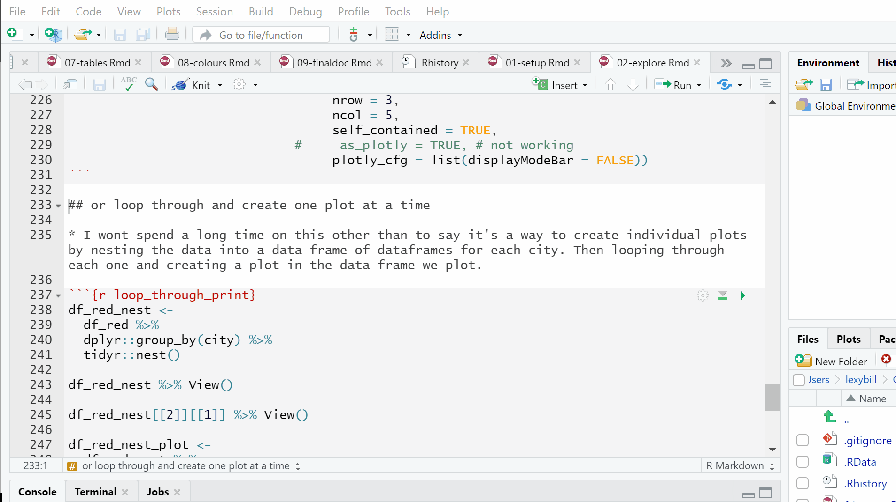
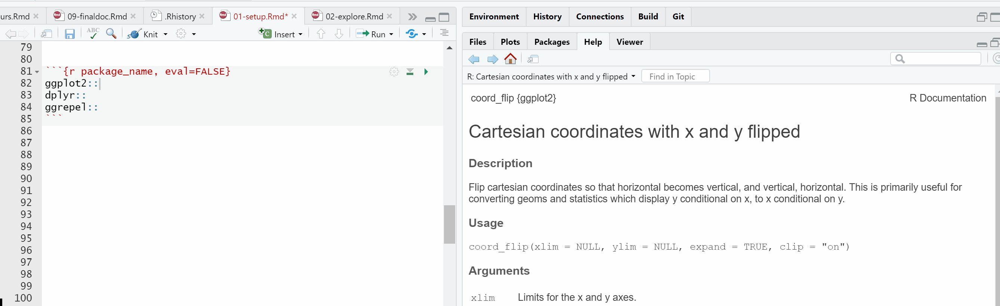

# Setup {#intro}

## Navigate R markdown quickly 

* To quickly find part of your code to edit, instead of scrolling up and down the [R Markdown](https://bookdown.org/yihui/rmarkdown/) code, jump instantly to the right section by using the document outline. You can show the outline in one of three ways:

1. Hold down `Ctrl+Shift+O`. 

2. Click the top-right icon in the code pane.

3. Left-click on the bottom bar of the R markdown file. 

The gif below shows these three methods. It's recorded with [ScreenToGif](https://www.screentogif.com/). I donated to the author as I found it so easy to use as well as providing lots of genuinely useful features - for example, a gif progress bar and the ability to pixelate out sections of the recording.

```{r, echo=FALSE, out.width = "100%"}
 
```

## Rstudio shortcuts

* Another tip to speed up coding in RStudio is to use keyboard shortcuts. Here is the full list of [RStudio shorcuts](https://support.rstudio.com/hc/en-us/articles/200711853-Keyboard-Shortcuts).

* I use `Ctrl+Shift+M` in Windows (`Cmd+Shift+M` in Mac) to insert a pipe `%>%` with spaces which makes tidyverse coding fast.

* I also use `Alt+-` in Windows (`Option+-` in Mac) to create the assign operator `<-`.

## Load R packages to your library

Here are all the R packages used in this book. 

```{r libraries, echo=TRUE,message=FALSE,warning=FALSE,results='hide'}
# data vis https://www.htmlwidgets.org/index.html
library(ggplot2) # static charts - amazing variety
library(plotly) # interactive charts
library(apexcharter) # much like the paid for highchater js library. Powerful
library(trelliscopejs) #  small multiples
library(dygraphs) # awesome interactive timeseries

# ggplot extensions https://www.ggplot2-exts.org/gallery/
library(scales) # improve your scales
library(gganimate) # animate your ggplot
library(png) # 
library(directlabels) # for directly labelling lines for example
library(gghighlight) # label points of interest on your charts
library(ggrepel) # move labels so they don't overlap
library(glue) # 

# colours
library(RColorBrewer) # ready to use colour pallets
library(prismatic) # palettes and ways to tweak an entire pallete

# tables
library(kableExtra) # attractive static tables
library(formattable) # colour tables. Like Excel's conditional formattinng
library(rpivotTable) # like Excel's pivot table
library(DT) # awesome interactive tables
library(reactable)

# Quality Assurance
library(tidylog) # great for QA on the fly 
library(testthat) # for writing unit tests
library(assertr) # for writing tests verify assumptions about data early in the data pipeline of manipulation

# wrangling / munging / manipulating
library(tidyverse) # loads of useful packages in one 

library(crosstalk) # link html widgets like plotly to DT tables

# time series tools
library(anytime) # convert text into the right date type
library(tsbox) # convert to time series for dygraphs

# sample data
library(mosaicData) # sample data
```

## The data to visualise

* Often in EDA and data visualisation, we are most interested in how values change over time. For example, are things getting worse, better, higher, lower? For this reason, instead of using a [built in data set](https://stat.ethz.ch/R-manual/R-devel/library/datasets/html/00Index.html) like iris or mtcars we mostly use the [Texas housing sales ](http://vincentarelbundock.github.io/Rdatasets/doc/ggplot2/txhousing.html) data in this book. This is a time-series data set built into ggplot.

* To improve your skills I recommend finding other open data sets to develop your data vis skills. I found the marriage data we look at later in this [comprehensive list of R datasets](https://vincentarelbundock.github.io/Rdatasets/). The [Tidy Tuesday](https://github.com/rfordatascience/tidytuesday) data sets are also a great source of data sets. You also get to learn from seeing how others (including David Robinson) have tackled them. 

* You could also look for data stories that interest you or that you could improve and explore further. I recently saw a data visualisation in The Times newspaper on [smoking and vaping](https://github.com/billster45/improve_a_data_viz/blob/master/README.md) that I tried to improve.

* The only manipulation we will do to the Texas housing sales data below is to create a real date using [lubridate](https://lubridate.tidyverse.org/). This book doesn't cover the data manipulation part of EDA. A good guide is the [Managing Data Frames with the `dplyr` package](https://bookdown.org/rdpeng/exdata/managing-data-frames-with-the-dplyr-package.html) chapter in Roger Peng's [Exploratory Data Analysis with R](https://bookdown.org/rdpeng/exdata/). As well as the resources described in bullet 1 [here](https://github.com/billster45/r-guides-and-galleries#learn-to-analyse-data-with-r).

```{r create_df, message=TRUE}
# create a data frame with a real date for plotting
df <- ggplot2::txhousing %>% 
  dplyr::mutate(date = lubridate::make_date(year = year,
                                              month = month, 
                                              day =1)) 
```

* Here are the top few rows of the data frame we created using a simple kableExtra table. The [Tables] chapter later on in this book describes different table methods in more detail.

```{r}
kableExtra::kable(utils::head(df))
```

## QA and Unit tests

### tidylog

* We'll also use [tidylog](https://github.com/elbersb/tidylog/blob/master/README.md) with dplyr. Tidylog is an easy way to include fast basic Quality Assurance during dplyr data manipulation. Just replace the dplyr verbs with the same verb in tidylog. Tidylog tells you what each dplyr verb has done to your data. For example, how many rows `dplyr::filter()` drops or adds, or what percentage of values `dplyr::mutate()` has changed.

```{r, message=TRUE}
# create a data frame with a real date for plotting
df <- ggplot2::txhousing %>% 
  tidylog::mutate(date = lubridate::make_date(year = year,
                                              month = month, 
                                              day =1)) 
```

* The tidylog message above tells us that the mutate has changed `(100%) of 'date' (0 new NA)`. This is what we would expect to happen.

* Let's also create a data frame with fewer cities so that some plots created later will be less crowded. Below we select only cities where the maximum number of sales in any month is more than 500.

```{r}
# reduce the number of cities for simpler plots
df_red <- df %>% 
  dplyr::group_by(city) %>% 
  tidylog::mutate(sales_max = base::max(sales)) %>% 
  dplyr::ungroup() %>% 
  tidylog::filter(sales_max >= 500)
```

* Hold on. Look! Read the tidylog message above. It says `new variable 'sales_max' with 27 unique values and 43% NA`. As we filter the rows in the next line of code by `sales_max` we don't want any of the values to be NA. Well spotted tidylog. We correct it below by removing NAs from `salses_max` by adding `na.rm = TRUE` inside the `base:max()` function.

```{r}
# reduce the number of cities for simpler plots
df_red <- df %>% 
  dplyr::group_by(city) %>% 
  tidylog::mutate(sales_max = base::max(sales, 
                                        na.rm = TRUE)) %>% 
  dplyr::ungroup() %>% 
  tidylog::filter(sales_max >= 500)
```

* The tidylog message above now tells us that the new variable `sales_max` has `0% NA` as we would expect.

### testthat

* Unit testing is mostly used during the creation of [R packages](http://r-pkgs.had.co.nz/). It can also be part of your analysis code. Particularly if your work is high impact and you need to be confident the results are still valid in the future. For example, you are running new data through your code or when you have added new logic. Unit tests are an automatic way to highlight errors new data or new logic has introduced you may not have spotted.

* Hadley Wickham provides some useful ["what to test"](https://r-pkgs.org/tests.html#what-to-test) rules of thumb for when to use [unit tests](https://r-pkgs.org/tests.html) in his [R packages book](http://r-pkgs.had.co.nz/):

> Strive to test each behaviour in one and only one test. Then if that behaviour later changes you only need to update a single test.

> Avoid testing simple code that you’re confident will work. Instead focus your time on code that you’re not sure about, is fragile, or has complicated interdependencies. That said, I often find I make the most mistakes when I falsely assume that the problem is simple and doesn’t need any tests.

> Always write a test when you discover a bug. You may find it helpful to adopt the test-first philosophy. There you always start by writing the tests, and then write the code that makes them pass. This reflects an important problem solving strategy: start by establishing your success criteria, how you know if you’ve solved the problem.

* In this unit test we're immediately going to break Hadley's second rule above and write a test on the simple code that created our dataframe `df`. The unit tests are all adapted from an [excellent introductory blog](https://katherinemwood.github.io/post/testthat/) on unit tests. The code has been altered to follow the three [Code style] rules described in the next chapter to make these examples easier to read and understand.

* First, let's test if the dimensions of `df` are as we expect with 9 columns and 8,602 rows.

```{r}
testthat::test_that("data dimensions correct", {

    testthat::expect_equal(
    object = base::ncol(df),
    expected = 9
  )

  testthat::expect_equal(
    object = base::nrow(df),
    expected = 8602
  )
})
```

* This `testthat::test_that()` test does not return a message, so we know `df` has passed because the dimensions are as we expect. Let's now test data types. 

```{r}
testthat::test_that('data types correct', {
  
  testthat::expect_is(object = df,
                      class = 'data.frame')
  
  testthat::expect_is(object = df$date, 
                      class = 'Date')
})

```

* Again, this test no messages so `df` has passed this test. Finally, let's run a test we know will fail to see what failure message returns.

```{r, error=TRUE}
testthat::test_that("no missing values", {

    testthat::expect_identical(
    object = df,
    expected = stats::na.omit(df)
  )
})
```

* The code above tests if the original `df` object is identical to the `expected` object after omitting rows with NA values (using `stats::na.omit()`). The testthat message tells us the object and the expectation have a `Different number of rows`. We can now investigate this test failure by eye-balling some rows of `df` where any of the columns contain a missing value. Then decide if this is what we would expect from this data source.

```{r}
df %>%
  dplyr::filter_all(dplyr::any_vars(base::is.na(.))) %>%
  utils::head() %>% 
  kableExtra::kable()
```

### assertr

* You can also run tests [piped](https://www.datacamp.com/community/tutorials/pipe-r-tutorial#intro) directly within your data manipulation code using [assertr](https://docs.ropensci.org/assertr/). This  [assertr vignette](https://cran.r-project.org/web/packages/assertr/vignettes/assertr.html) has good examples on built-in data, as well as the assert section at the bottom of this [good blog](https://sharla.party/post/new-data-strategies/).

* Below we purposely ensure the assertr tests will fail all the tests so we can read the useful error output it can create.

```{r, error=TRUE}
df %>%   
  assertr::chain_start() %>% 
  assertr::verify(base::nrow(.) == 8601) %>% 
  assertr::verify(base::ncol(.) ==8) %>%
  assertr::assert(in_set(1:11), 
                  month) %>%
  assertr::assert(in_set(2000:2014), 
                  year) %>%
  assertr::assert(within_bounds(lower.bound = 0,
                                upper.bound = Inf, 
                                include.lower= TRUE,
                                allow.na = TRUE), -city,-date) %>%
  assertr::insist(within_n_sds(3), 
                  sales:inventory,) %>%
  assertr::assert(not_na, dplyr::everything()) %>% 
  assertr::chain_end(error_fun = error_stop)
```

* Then we adjust all of the tests so that they pass. 

```{r}
df %>%   
  assertr::chain_start() %>% 
  assertr::verify(base::nrow(.) == 8602) %>% 
  assertr::verify(base::ncol(.) ==9) %>%
  assertr::assert(in_set(1:12), 
                  month) %>%
  assertr::assert(in_set(2000:2015), 
                  year) %>%
  assertr::assert(within_bounds(lower.bound = 0,
                                upper.bound = Inf, 
                                include.lower= TRUE,
                                allow.na = TRUE), -city,-date) %>%
  assertr::insist(within_n_sds(11), 
                  sales:inventory,) %>%
  #assertr::assert(not_na, dplyr::everything()) %>% 
  assertr::chain_end(error_fun = error_stop) %>% 
  utils::head()
```

* The code above returns the data frame which means assertr code could be part of your data preparation code when `df` was created.

```{r}
df <- ggplot2::txhousing %>% 
  dplyr::mutate(date = lubridate::make_date(year = year,
                                              month = month, 
                                              day =1)) %>% 
  assertr::chain_start() %>% 
  assertr::verify(base::nrow(.) == 8602) %>% 
  assertr::verify(base::ncol(.) ==9) %>%
  assertr::assert(in_set(1:12), 
                  month) %>%
  assertr::assert(in_set(2000:2015), 
                  year) %>%
  assertr::assert(within_bounds(lower.bound = 0,
                                upper.bound = Inf, 
                                include.lower= TRUE,
                                allow.na = TRUE), -city,-date) %>%
  assertr::insist(within_n_sds(11), 
                  sales:inventory,) %>%
  #assertr::assert(not_na, dplyr::everything()) %>% 
  assertr::chain_end(error_fun = error_stop)
```

## Code style 

### Rule 1: Include names before all functions

* Include the package name before every function, even for [base R](https://rstudio.com/wp-content/uploads/2016/05/base-r.pdf) functions, to make your code easier to read, 

* I started learning R by reading other people's code. But I got confused where functions came from. Particularly when they used functions from lots of different packages mixed with base functions and their own functions, but without the package name shown. It made their code appear more complicated and intimidating than it was.

* Another benefit of including the package name is hitting the tab key at the end of the double colon let's us browse all the package's functions in a scrollable list.

* Also, try highlighting a function and its package name then hit the `F1` key to show the help page. While hitting the `F2` key can be a quick way to see all the possible arguments in a function. As well as seeing the default argument values the package author has chosen for you.

```{r, echo=FALSE, out.width = "1100%"}
 
```

### Rule 2: Add argument names to all functions

* Instead of relying on the order of the arguments the function expects, name every argument when you set its value. Your code will be quicker to understand when we know which arguments are set without having to read the help page for that function.

### Rule 3: Each line does one thing

* Each line of code should do one thing. You can do this by hitting the return key after every pipe `%>%`, comma, or plus `+`. RStudio will then automatically indent your code in just the right way. You can also indent old code by blocking on to it and using the [RStudio shorcut](https://support.rstudio.com/hc/en-us/articles/200711853-Keyboard-Shortcuts) `Ctrl+Shift+A` in Windows (`Command+Shift+A` in Mac). 

* The code below works but doesn't follow the three rules. It is cramped, slow to understand, and can be difficult to edit or re-use.

```{r cramped_code, eval=FALSE}
ggplot(df) +
  geom_line(aes(date,sales, colour = city)) +
  ggplot2::theme_minimal() +
  gghighlight(max(sales) > 5000, label_params = list(size = 4)) +
  scale_y_continuous(labels = scales::comma) +
  scale_x_date(date_breaks = "1 year", labels = scales::date_format("%d %b %y"), limits = c(as.Date("2000-01-01"), as.Date("2015-07-01"))) +
  labs(title = "US Housing Sales over time", subtitle = "US cities with more than 5k sales in a month", caption = "Source: ggplot2 package demo data") +
  geom_vline(xintercept = years, linetype = 4) +
  theme(panel.grid.major.x = element_blank(), panel.grid.minor.x = element_blank(), strip.text.x = element_text(size = 10), axis.text.x = element_text(angle = 60, hjust = 1, size = 9), legend.text = element_text(size = 12), legend.position = "right", legend.direction = "vertical", plot.title = element_text(size = 22, face = "bold"), plot.subtitle = element_text(color = "grey", size = 18), plot.caption = element_text(hjust = 0, size = 12, color = "darkgrey"), legend.title = element_blank())
```

* In contrast, the code below is identical to the code above, but it follows the three rules so you can more easily:

1. Run your code top downwards in chunks adding more lines each time. Much like the popular ggplot flip-books I describe at bullet 11 in my collection of [R guides and galleries](https://github.com/billster45/r-guides-and-galleries/blob/master/README.md#learn-to-visualise-data-with-r).

2. Comment out one line of code (or just one argument in a function) to understand what it does when you run the code without it.

3. Find and edit arguments in a function (e.g. a font size)

4. Help others QA or re-use your code.

5. Help others new to R understand what you are doing and learn faster.

6. Avoid being a gatekeeper of your R knowledge and skills. Share, explain and democratise what you know. You can then move on to more sophisticated analysis in R with an even higher value. Richard Susskind advocates this in [The Future of Professions](https://www.amazon.co.uk/dp/0198713398/)) and in my example of describing [NLP techniques intuitively](https://github.com/billster45/NLP-Intuition/blob/master/README.md).

* Further tweaks to improve code clarity are to put spaces either side of the equals sign and to use [styler](https://styler.r-lib.org/) to apply some of these rules automatically. You can also [customise styler](https://cran.r-project.org/web/packages/styler/vignettes/customizing_styler.html) to apply your own rules. I want to try customising styler to apply rules 1 to 3 above. I don't know if that's possible yet.

```{r clean_code, eval=FALSE}
df %>%
  ggplot2::ggplot() +
  ggplot2::aes(
    x = date,
    y = sales,
    colour = city
  ) +
  ggplot2::geom_line() +
  ggplot2::theme_minimal() +
  gghighlight::gghighlight(max(sales) > 5000,
                           label_params = list(size = 4)
  ) +
  ggplot2::scale_y_continuous(labels = scales::comma) +
  ggplot2::scale_x_date(
    date_breaks = "1 year",
    labels = scales::date_format("%d %b %y"),
    limits = c(
      as.Date("2000-01-01"),
      as.Date("2015-07-01")
    )
  ) +
  ggplot2::labs(
    title = "US Housing Sales over time",
    subtitle = "US cities with more than 5k sales in a month",
    caption = "Source: ggplot2 package demo data"
  ) +
  ggplot2::geom_vline(
    xintercept = years,
    linetype = 4
  ) +
  ggplot2::theme(
    panel.grid.major.x = element_blank(),
    panel.grid.minor.x = element_blank(),
    strip.text.x = element_text(size = 10),
    axis.text.x = element_text(
      angle = 60,
      hjust = 1,
      size = 9
    ),
    legend.text = element_text(size = 12),
    legend.position = "right",
    legend.direction = "vertical",
    plot.title = element_text(
      size = 22,
      face = "bold"
    ),
    plot.subtitle = element_text(
      color = "grey",
      size = 18
    ),
    plot.caption = element_text(
      hjust = 0,
      size = 12,
      color = "darkgrey"
    ),
    legend.title = element_blank()
  )
```

* Note this layout differs from the [layered grammar of graphics](https://r4ds.had.co.nz/data-visualisation.html#the-layered-grammar-of-graphics) code template below.

```{r, eval = FALSE}
ggplot(data = <DATA>) + 
  <GEOM_FUNCTION>(
     mapping = aes(<MAPPINGS>),
     stat = <STAT>, 
     position = <POSITION>
  ) +
  <COORDINATE_FUNCTION> +
  <FACET_FUNCTION>
```

* My preference is for the code style to let you imagine data being "poured" into ggplot through the pipe. Then we tell ggplot which columns to map, then the geom, followed by the same co-ordinate and facet functions as Wickham recommends.

* This is inspired by the code layout of the many flipbook guides (see bullet 11 [here](https://github.com/billster45/r-guides-and-galleries/blob/master/README.md#learn-to-visualise-data-with-r) for examples).

```{r, eval=FALSE}
<DATA> %>% 
  ggplot2::ggplot() + 
  ggplot2::aes(<MAPPINGS>) +
  ggplot2::<GEOM_FUNCTION>(
     stat = <STAT>, 
     position = <POSITION>
  ) +
  <COORDINATE_FUNCTION> +
  <FACET_FUNCTION>
```