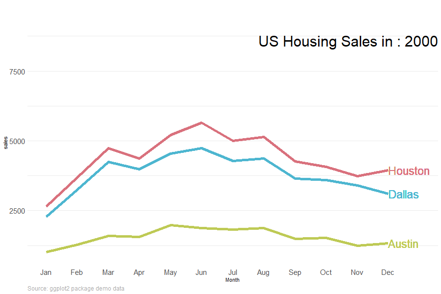

# Animation

## ggplot animation

* Animation is quick to add to ggplot using the gganimate package. I've had a play [here](https://github.com/billster45/gganimate-experiments/blob/master/README.md) inspired by a good Tweet of examples.

* I've found animation is usually most effective at showing changes over time. Here is the annual pattern of house sales changing each year.

```{r, echo=FALSE, out.width = "80%"}
 
```

```{r animate_housing,eval= FALSE}
# Method from: https://github.com/thomasp85/gganimate/wiki/Temperature-time-series
# https://stackoverflow.com/questions/54945861/problems-with-geom-text-and-pausing-the-animation

# for each city and year find the sales value in the latest month availalbe 
# usually this is 12 but sometimes it's an earlier month 
label_anim <- 
  df %>% 
  dplyr::group_by(city,year) %>% 
  dplyr::summarise(max_month = max(month)) %>% 
  dplyr::ungroup() %>% 
  dplyr::inner_join(df_red, by = c("city"="city",
                                   "year"="year",
                                   "max_month" = "month")) %>% 
  dplyr::mutate(label_it = sales) %>% 
  dplyr::select(city,year,max_month,label_it) 

colors <- c("Houston" = "#D9717D", "Dallas" = "#4DB6D0", "Austin" = "#BECA55")

p <- df %>% 
  dplyr::filter(city %in% c("Houston", "Dallas", "Austin")) %>% 
  dplyr::left_join(label_anim, 
                   by = c("city" = "city","year" = "year")) %>%  
  ggplot2::ggplot() +
  ggplot2::aes(x = month, 
               y = sales,
               colour = city) +
  ggplot2::geom_line(size = 2) +
  ggplot2::theme_minimal() +
  ggplot2::coord_cartesian(clip = 'off') + # allow labels outside of plot
  ggplot2::theme(legend.position = "none") +
  gganimate::transition_states(states = year,
                               transition_length = 3,
                               state_length = 1) +
  ggplot2::labs(title = "Texas Housing Sales in : {closest_state}",
    caption = "Source: ggplot2 package demo data"
  ) +

  ggplot2::theme(plot.title = element_text(hjust = 1,
                                           vjust = -10,
                                           size = 30),
    panel.grid.major.x = element_blank(),
    panel.grid.minor.x = element_blank(),
    strip.text.x = element_text(size = 15),
    axis.text.x = element_text(size = 15),
    axis.text.y = element_text(size = 15),
    plot.caption = element_text(
      hjust = 0,
      size = 12,
      color = "darkgrey"
    )
  ) +
  ggplot2::scale_color_manual(values = colors) +
  ggplot2::scale_x_continuous(name = "Month", 
                     limits = c(1,13),
                     breaks = c(1,2,3,4,5,6,7,8,9,10,11,12),
                     label = c("Jan","Feb","Mar","Apr","May","Jun","Jul","Aug","Sep","Oct","Nov","Dec")) +
  ggplot2::geom_text(aes(x = max_month,
                         y = label_it,
                         label = city), 
            hjust = 0,
            size = 8) 

gganimate::animate(p, width = 900, 
                   height = 600, 
                   end_pause = 10,
                   fps = 20, 
                   rewind = FALSE, 
                   duration = 15)

gganimate::anim_save(filename = "housing.gif")
```

## plotly animation

* Carson Sievert's book shows us how to [animate in plotly](https://plotly-r.com/animating-views.html).

* The code to animate a plotly plot is easier than for ggplot. Simply specify which column to animate over in the frame argument of plotly::add_lines().

```{r}
df_red %>% 
  plotly::plot_ly(alpha  = 1) %>%
  plotly::add_lines(
    x = ~month, 
    y = ~sales,
    frame = ~year,  # this single line of code turns it into an animation!
    color = ~factor(city),
    line = list(simplify = FALSE)
  ) %>%
  plotly::layout(yaxis = list(title = "Sales"))
```

* Here we play around with the animation style.

```{r}
df_red %>% 
  plotly::plot_ly(alpha  = 1) %>%
  plotly::add_lines(
    x = ~month, 
    y = ~sales,
    frame = ~year, 
    color = ~factor(city),
    line = list(simplify = FALSE)
  ) %>%
  plotly::layout(yaxis = list(title = "Sales")) %>% 
  plotly::animation_opts(frame = 1000, 
                       #  easing = "elastic", 
                         easing = "bounce", 
                         redraw = FALSE) %>%
  plotly::animation_slider(currentvalue = list(prefix = "YEAR ", 
                                               font = list(color="blue")))
```


